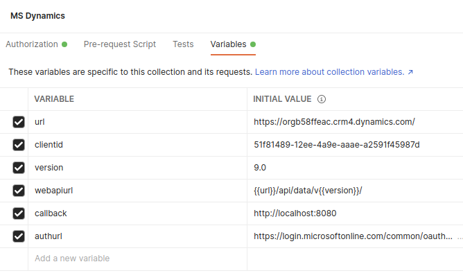
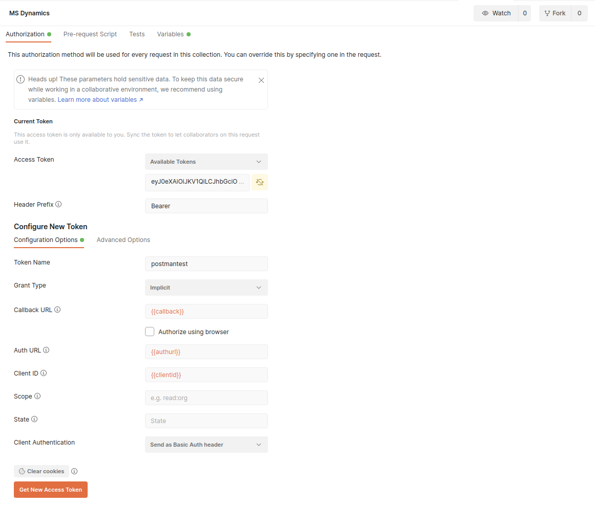
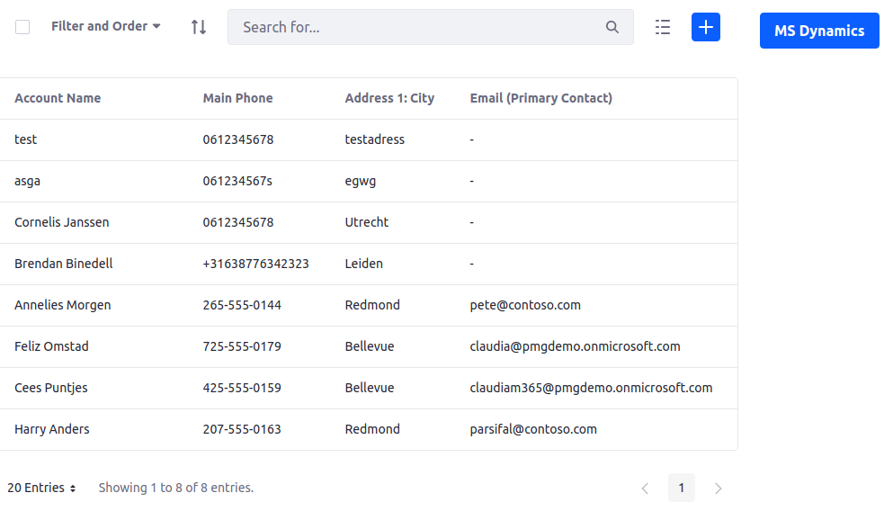

Based upon https://github.com/fafonso/liferay-ms-dynamics-poc

## Steps
1. Deploy the jar files in Liferay DXP
2. Create MS Dynamics (test) account [here](https://dynamics.microsoft.com/en-us/)
3. Import [MS Dynamics.postman_collection.json](MS Dynamics.postman_collection.json) in Postman (Pro TIP: use the raw import)
4. Modify the variables to your needs/setup
   
5. Retrieve the access token
   
6. Copy the token. (Pro TIP: Token is only valid for limited amount of time)
7. In Liferay DXP go to `System Settings` > `Microsoft 365`
8. Set `MS Dynamics Host`, `MS Dynamics Accounts Owner` and `MS Dynamics OAuth2 Token` (from step 6)
9. Create a new page in your site and drag-n-drop the `Accounts Widget` on to the page.
   
10. You should be able to  
  a. Create a new account in MS Dynamics and see this in the widget (hit Refresh)  
  b. Create a new account in the widget and see this in MS Dynamics  